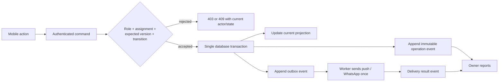

# Kiara Mobile CRM — Production Readiness and Execution Plan

Status: **not ready for a full employee rollout yet**  
Audit date: 2026-08-11  
Primary launch surface: Expo mobile app  
Secondary surfaces: owner web reports and operational administration

## 1. Product decision

Kiara already has a strong Arabic RTL mobile foundation, usable inbox filters, conversation claiming, animated list updates, scoped push plumbing, a mobile order view, and early driver/specialist flows. Those pieces are a good prototype, but the system must not be treated as production-safe for the whole team yet.

The launch blockers are operational integrity, not visual polish:

1. More than one employee can still edit or dispatch the same order without a reliable conflict barrier.
2. Important state is stored in mutable metadata, so reports cannot reliably prove who performed an action at that time.
3. Rekaz is copied into one replaceable JSON snapshot; it cannot produce an accurate pending-change count or change history.
4. Driver and specialist steps have timestamps but no trusted actor/device/location evidence.
5. There are no active field accounts in the current database, so drivers and specialists cannot use the field app yet.
6. Hanan is an active tenant admin and can open the existing reports, but the reports are current-state summaries, not yet management-grade accountability reports.
7. The mobile chat and order flows do not yet have web parity: customer profile, service history, media, reservation lifecycle, invoice attachments, and complete confirmation flows are missing or partial.
8. Automated mobile testing is insufficient for a role-based operational launch.

The rollout must therefore be split into two gates:

- **Operations Launch:** safe chat, calendar, orders, Rekaz sync, field execution, auditability, push, and owner core reports.
- **Intelligence Launch:** evidence-backed AI analysis, next-best-service recommendations, and editable retargeting messages.

AI must not be allowed to compensate for missing operational facts.

## 2. Experience principles

### 2.1 One role, one obvious next action

- Customer service sees the most urgent queue and the next required customer/order action.
- A driver sees only assigned orders and one enabled progression button.
- A specialist sees only assigned sessions and one enabled progression button.
- Hanan sees exceptions and evidence first, not a wall of charts.

### 2.2 WhatsApp-simple interaction

- Bottom navigation is limited to three or four role-relevant destinations.
- Primary actions are full-width, thumb-reachable, and named as verbs.
- Long forms are split into short sheets with progressive disclosure.
- The app preserves the selected day, scroll location, and unsent draft.
- New messages animate into position without removing the item the employee is currently reading.
- Empty, loading, offline, conflict, and permission-denied states always explain the next action.

### 2.3 No hidden commits

Every action that sends customer-, driver-, or specialist-facing content must show the exact final content before sending. The content must be editable in the confirmation surface. Automatic attachments, package images, app links, and signatures must be shown clearly before confirmation.

### 2.4 No silent operational conflicts

If another employee changes the conversation or order, the current employee must see who changed it and what changed. The app refreshes the record and never silently overwrites the newer state.

## 3. Role-based information architecture

### Customer service

Bottom tabs:

1. **اليوم** — urgent conversations, follow-ups due, orders starting soon, Rekaz pending changes.
2. **المحادثات** — `جديد`, `غير مستلمة`, `خطر`; a secondary `محادثاتي` filter is available inside the screen.
3. **التقويم** — day-strip agenda for reservations and operational orders.
4. **حسابي** — status, notification health, language/theme, sign out.

The home screen is not a dashboard. It is an action queue ordered by business risk.

### Driver

Bottom tabs:

1. **مهامي** — today and next assigned rides.
2. **السجل** — completed and exception orders.
3. **حسابي** — permission and notification health.

The order screen exposes only customer/address details required for the assigned ride and only the driver-owned transitions.

### Specialist

Bottom tabs:

1. **جلساتي** — assigned sessions grouped by day.
2. **السجل** — completed sessions.
3. **حسابي** — preferred language and notification health.

The specialist receives the final localized instruction, can play an attached voice note, and can confirm only the specialist-owned transitions.

### Owner/admin

- Mobile: **اليوم**, **التنبيهات**, **الفريق**, **حسابي** for immediate oversight.
- Web/tablet: full reports, drill-down evidence, Rekaz sync administration, team and configuration.
- Admin override is permitted only through an explicit takeover or override action with a required reason.

## 4. Core mobile screen specifications

### 4.1 Today

Cards appear only when action is required:

- Conversations beyond the six-minute response SLA.
- Unassigned conversations.
- Customer confirmation or cancellation checks due before driver departure.
- Same-day reservations missing operational confirmation.
- Orders starting soon with no driver or specialist acceptance.
- Field steps late or GPS evidence missing.
- Rekaz changes waiting to be pulled.
- Failed outbound messages or sync runs.

Each card has one primary action. Counts link to a filtered list, not a generic dashboard.

### 4.2 Conversation list

Primary chips:

- `جديد`
- `غير مستلمة`
- `خطر` — customer has waited more than six minutes without a customer-service response.

Additional controls:

- `محادثاتي` toggle.
- Typing-now indicator.
- Animated reorder for a new message, while preserving the active row and scroll anchor.
- Unread badge and latest-message preview.
- Assigned employee avatar/name.
- Network and notification health indicator.

Taking a conversation is atomic: exactly one employee wins. Until claimed, the message composer is replaced by `استلام المحادثة`. An admin who wants to reply to an assigned conversation must explicitly take it over and provide a reason.

### 4.3 Chat

The mobile chat must reach practical parity with the web experience:

- Text, image, PDF, audio, and document messages.
- Reply states, sending/retry state, and message delivery state.
- Saved replies and service/package picker.
- Editable outbound content confirmation where required.
- Reservation stage controls:
  - `استلام بيانات`
  - `انتظار تأكيد الحجز`
  - `تم تأكيد الحجز`
  - `إرفاق الفاتورة`
  - `قيد التنفيذ`
  - `تم التنفيذ`
- Follow-up outcomes: confirmed, cancelled, no response, rescheduled.
- Same-day urgency and cancellation-before-driver-departure warning.
- Customer name is a button that opens the customer profile.

### 4.4 Customer profile

Header:

- Name, canonical phone number, latest satisfaction state, total reservations, completed services, cancellations, and no-shows.

Sections:

1. **Timeline** — messages, reservations, changes, confirmations, cancellations, invoices, rides, sessions, and internal notes.
2. **Services** — service/package, date, price, outcome, specialist.
3. **Reservations** — upcoming and previous visits.
4. **Satisfaction** — deterministic indicators first; AI summary only after `تحليل الآن`.
5. **اقتراح ذكي** — generated only after the employee asks.

The next-best-service result contains:

- Recommended package card with the real catalog image.
- Reason and evidence used.
- Confidence and exclusion warnings.
- `إنشاء رسالة` action.
- A confirmation sheet showing the exact editable message and the package image that will be attached.

No AI recommendation or message is generated on page load, and nothing is auto-sent.

### 4.5 Calendar-first orders

Default view:

- Horizontal, swipeable day strip.
- Vertical agenda for the selected day.
- Month/date picker in a sheet, not an always-visible month grid.
- Smooth previous/next-day transitions with cached neighboring days.
- Filters for same-day, planned, incomplete, driver needed, and exceptions.

Each visit card shows:

- Time, customer, services, Rekaz status, operational status, confirmation state, driver/specialist state, and warnings.
- Tapping the customer opens the customer profile.
- Tapping the card opens the full order.
- `طلب سائق` opens the confirmation flow in place; it does not redirect the employee to another calendar step.

The Rekaz banner uses clear, actionable copy:

> 10 تغييرات جديدة من ركاز لم يتم سحبها

Actions:

- `مراجعة` shows added, changed, and cancelled counts.
- `سحب الآن` applies the delta under one sync lock.
- Last successful sync time and failures are visible.

### 4.6 Field order

The screen is a vertical progress timeline with exactly one enabled primary action.

Driver-owned transitions:

1. Accept assignment.
2. Start trip.
3. Arrived / handoff complete.

Specialist-owned transitions:

1. Accept session.
2. Start session.
3. Complete session.

Every transition stores server time, actor, assigned role, device, idempotency key, and location evidence when required. The client cannot submit a later step before the prior step exists.

Before `بدء الرحلة`, the app explains why location is needed and requests foreground permission. Background permission is requested incrementally only if active-trip route monitoring is enabled. Tracking stops at arrival/completion and cannot run outside an active assigned trip.

If location is unavailable or inaccurate, the app shows the reason and allows a controlled exception with an employee-entered explanation. The exception appears in the owner report.

## 5. Canonical data architecture

Mutable domain tables hold the current projection; append-only events prove what happened.

### Identity and customer history

- `customers` — tenant-scoped canonical customer.
- `customer_phone_aliases` — normalized phone variants mapped to one customer.
- `customer_service_history` or normalized reservation/service joins.

Phone substring matching must be removed from operational joins. Every imported reservation and conversation is resolved to a canonical customer ID.

### Rekaz sync

- `rekaz_sync_runs` — started/finished time, actor, status, cursor/range, counts, error.
- `rekaz_reservations` — one row per source reservation with source ID, normalized fields, payload hash, source update time, and deletion/cancellation state.
- `rekaz_changes` — added/updated/cancelled/removed change record with before/after hash and sync run.
- `operational_visits` — Kiara day/customer visit projection linking reservations, conversation, and local order.

### Operations

- Existing conversations and orders gain `version` and normalized lifecycle fields.
- `reservation_followups` replaces follow-up state stored inside conversation metadata.
- `field_order_progress` remains the current projection.
- `operation_events` is append-only and records all accountable actions.
- `outbox_events` guarantees exactly-once dispatch intent for WhatsApp, push, and internal notifications.
- `edit_leases` provides presence such as “Huda is editing”; it improves UX but does not replace version checks.

### AI

- `ai_insights` stores requested insight type, input snapshot hash, model/version, evidence references, output, requester, time, and user feedback.
- Generated drafts are separate from sent messages.
- A sent event stores the exact edited content and package attachment confirmed by the employee.

### Location

- `field_location_checkpoints` stores step evidence: position, accuracy, source, permission state, device, and server receipt time.
- Optional `active_trip_location_samples` stores temporary route samples only while a trip is active.
- Raw route samples have a documented short retention period; audit summaries may be retained longer.

## 6. Command, event, and outbox wall

Every business mutation uses one server command. Clients never write operational tables directly.

Every command includes:

- `idempotencyKey`
- `expectedVersion`
- actor identity and role from the authenticated session
- device ID
- explicit transition or patch
- client time only as diagnostic data; server time is authoritative

Rules:

- The database locks or compare-and-swaps the target row.
- Invalid transitions fail even if the client UI accidentally exposes them.
- Retrying the same idempotency key returns the previous result without duplicating messages.
- A stale version returns `409 Conflict`, the latest record, and the employee who changed it.
- Projection update, audit event, and outbox insertion commit together or not at all.
- Delivery happens after commit and is retried by the worker, not by repeating the business transition.

## 7. State ownership and interruption prevention

| Domain | Allowed actor | Conflict wall |
|---|---|---|
| Take conversation | Unassigned CS/admin | Atomic first-writer-wins claim |
| Reply | Assigned CS | Assignment + version check |
| Colleague rescue | Active CS/admin after explicit takeover | Expected owner + required reason + event |
| Reservation stage | Assigned CS/admin | Allowed-transition RPC + version |
| Edit order | Assigned/authorized CS | Version + field-level audit diff |
| Dispatch | Authorized CS | Atomic `ready -> dispatching` transition + idempotency |
| Driver step | Assigned driver only | Server-side sequence + location policy |
| Specialist step | Assigned specialist only | Server-side sequence |
| Override | Owner/admin only | Reason required + alert/event |

Presence and edit leases warn the user before conflict. They are deliberately soft; transactional commands remain the source of correctness.

## 8. Rekaz sync design

The current Rekaz integration uses an adapter around a web endpoint and replaces a full JSON snapshot. It must be isolated behind a server-only interface because that endpoint may change.

### Check flow

1. A scheduled check or explicit `فحص التحديثات` fetches the configured range from the server-side Rekaz adapter.
2. Normalize fields and calculate a stable payload hash per source reservation.
3. Compare against `rekaz_reservations` without mutating applied state.
4. Store a pending preview with added, changed, cancelled, removed, and invalid counts.
5. Publish the banner count and sync health.

If Rekaz supplies a reliable updated cursor, use it. Otherwise the normalized hashes provide deterministic deltas.

### Pull flow

1. Acquire one tenant-level advisory lock.
2. Create a `rekaz_sync_runs` row.
3. Re-fetch or validate the preview freshness.
4. Stage and validate source rows.
5. Upsert reservation rows and append change events in one transaction.
6. Rebuild affected operational visits only.
7. Mark cancellations/removals without deleting history.
8. Complete the run and invalidate the mobile calendar cache.

Concurrent pulls return the currently running sync instead of starting another. Local driver orders link to a durable visit/reservation ID, not phone plus day.

## 9. Owner reports that identify the problem and responsible actor

Reports use deterministic event facts. AI can summarize or explain a selected report but cannot create the metric.

### Today — requires action

- Conversations above the six-minute SLA.
- Confirmation/cancellation follow-ups overdue.
- A driver departed without recorded customer confirmation.
- Orders or field steps late.
- Missing/denied/inaccurate location evidence.
- Failed dispatch, WhatsApp, push, or Rekaz sync.
- Same-day reservations missing operational ownership.

### Customer-service quality

- First-response median and P90.
- SLA breach count and percentage.
- Follow-up coverage before the operational cutoff.
- Cancellations discovered after driver departure.
- Order-entry corrections by field, creator, and corrector.
- Conversation transfers, takeovers, and unassigned duration.
- Failed or duplicate dispatch attempts.
- Complaints and satisfaction trend.

Every metric drills down to customer/order, event time, responsible actor at that time, evidence, and any override reason. It must not attribute old actions to the conversation's current assignee.

### Field quality

- Assignment acceptance time.
- Driver departure and arrival lateness.
- Distance from destination and GPS accuracy at required checkpoints.
- Location-permission exceptions.
- Specialist start/end adherence.
- Duration anomalies and incomplete sessions.

### Integration health

- Last Rekaz check and pull.
- Pending change count and age.
- Added/updated/cancelled/invalid counts.
- Failed sync runs and error category.
- Push token health and outbound delivery failures.

## 10. AI-powered CRM architecture

### Guardrails

- AI runs only after an explicit user action.
- The server assembles tenant-scoped evidence; the mobile client never sends arbitrary database access instructions.
- Employee identity is preserved in the transcript/event input so accountability analysis has evidence.
- Outputs cite internal evidence IDs/dates and expose uncertainty.
- AI never marks a customer, employee, or driver as at fault automatically.
- Human approval is required for every outbound message.
- Sensitive data is minimized and model/input/output versions are auditable.

### Satisfaction analysis

Inputs:

- Message content and sender identity.
- Response latency and follow-up events.
- Reservation outcomes, changes, complaints, and service history.

Outputs:

- Satisfaction signal, supporting evidence, risks, and recommended human check.
- No permanent customer label without employee confirmation.

### Next-best-service recommendation

1. Deterministically retrieve eligible, available packages and services from Kiara's catalog.
2. Exclude already active, recently used, unavailable, contraindicated, or policy-ineligible offers.
3. Join customer history, recency, frequency, satisfaction, cancellations, and new catalog items.
4. Ask AI to rank only the eligible candidates and explain the evidence.
5. Render the chosen real package object and image.
6. Generate a message only after `إنشاء رسالة`.
7. Show the exact editable message and automatic package image/link before send.

### Specialist translation

Dispatch is a two-step flow:

1. Generate a localized specialist draft from the specialist nationality/language.
2. Show the Arabic source, final translated text, voice attachment, and automatic link in an editable confirmation sheet.
3. Send exactly the confirmed version and store both source and final content.

## 11. Location and privacy policy

- Request location in context, immediately before the first action that requires it.
- Foreground checkpoint evidence is required for driver start/arrival and configured specialist start/end steps.
- Background tracking is allowed only for an active driver trip when enabled by policy.
- Do not background-track specialists by default.
- Stop tracking at arrival/completion, unassignment, logout, or explicit cancellation.
- Show a persistent active-trip tracking indicator.
- Restrict raw location access to owner/authorized operations roles.
- Log every manual exception and admin override.
- Define raw route retention, deletion, employee notice, and customer-address access policy before rollout.

Implementation requires Expo Location and TaskManager configuration, native permission descriptions, and development/production builds; Expo Go is not a valid push/background-location launch test environment.

## 12. Data synchronization and offline behavior

- React Query remains the server-state layer.
- Persist safe query data in encrypted/appropriate device storage; do not persist unnecessary message or location data.
- Connect app focus/network state to query refresh.
- Realtime invalidates scoped caches; it does not become the authoritative mutation path.
- Private Realtime topics are tenant/user scoped and protected by RLS policies.
- Critical transitions are never optimistic. Show a short pending state until the server command commits.
- Message drafts and safe non-critical UI state survive app restart.
- Offline business actions enter a visible queue only if the action is safe to replay with an idempotency key. Time-sensitive field transitions require a clear pending state and server validation when connectivity returns.
- The account screen shows last sync, push status, permission status, queued actions, and a repair action.

The un-applied private Realtime migration must be updated for the current Supabase Realtime schema restrictions before applying it. Do not attempt a prohibited `ALTER` on the managed `realtime` schema; create and verify the required authorization policy only.

## 13. Execution phases and acceptance gates

### Phase 0 — freeze the contract and measure the baseline

- Approve role matrix, lifecycle state machines, SLA cutoffs, location/retention policy, and report definitions.
- Remove the fixed dummy reservation from production code and move test fixtures to seed/dev-only data.
- Record current migration status and establish a staging Supabase project.
- Add structured logging, request IDs, command IDs, and error monitoring.

Gate: approved operational rules and a reproducible staging environment.

### Phase 1 — database truth and command wall

- Add canonical customers, normalized follow-ups, Rekaz tables, versions, operation events, outbox, idempotency, and edit leases.
- Implement transactional commands for conversation state, order edit, dispatch, and field progression.
- Add server-enforced role/assignment/transition checks and conflict responses.
- Fix/apply/test private Realtime authorization.

Gate: concurrency tests prove no duplicate claim, dispatch, message, or field step; every mutation has one accountable event.

### Phase 2 — mobile customer-service core

- Finish media-capable chat and reservation lifecycle parity.
- Make customer header navigable and build customer profile/timeline.
- Build Today action queue and calendar-first orders.
- Add Rekaz pending banner, preview, pull, and sync health.
- Replace alert-only sends with editable true-confirmation sheets.
- Add persisted drafts, network health, conflict recovery, and accessibility pass.

Gate: one customer-service employee can complete an entire normal and same-day order from mobile without opening the web app.

### Phase 3 — field execution and evidence

- Provision real driver and specialist accounts.
- Implement device registration, assignment-scoped push, role-specific field screens, and localized instructions.
- Add location permissions, checkpoints, optional active-trip tracking, exceptions, and retention job.
- Add timing, late-step, and failed-notification alerts.

Gate: a driver and specialist complete a staged order on physical iOS and Android devices, with correct timestamps, actor, notification, and location evidence.

### Phase 4 — owner accountability reports

- Build deterministic event-based metrics and drill-down evidence.
- Add Today exceptions, CS quality, field quality, and integration health.
- Add date/team/employee filters and export where operationally required.
- Add explicit employee takeover/override flow for conversations held by absent colleagues.

Gate: Hanan can answer “what failed, when, who owned it then, and what evidence proves it?” without querying raw data.

### Phase 5 — AI intelligence

- Add evidence-backed, on-demand satisfaction analysis.
- Add eligible-candidate retrieval, next-best-service ranking, package card/image, and editable generated message.
- Add localized specialist draft preview and feedback capture.
- Persist AI provenance and measure acceptance, edit, conversion, and false-positive rates.

Gate: AI never auto-sends, every claim has evidence, and all customer-facing output passes editable confirmation.

### Phase 6 — controlled rollout

1. Hanan and internal QA.
2. One customer-service employee, one driver, and one specialist.
3. A small shift using real low-risk orders with a staffed rollback channel.
4. Full team after the launch metrics remain within thresholds.

Use feature flags for Rekaz write/pull behavior, field tracking, AI, and owner alerts. Keep the existing web workflow available as a rollback path until mobile stability is proven.

## 14. Test strategy

### Unit tests

- Conversation/order/field transition reducers.
- Six-minute SLA and follow-up cutoff calculations.
- Phone canonicalization and customer resolution.
- Rekaz normalization, hashes, and added/changed/cancelled/removed delta logic.
- Next-best-offer eligibility.
- Location accuracy, distance, and exception rules.

### Database tests

- Tenant isolation and role matrix.
- Assignment-only access.
- Valid/invalid transitions.
- Expected-version conflicts.
- Replayed idempotency keys.
- Projection/event/outbox atomicity.
- Realtime topic authorization.

### API contract tests

- `401`, `403`, `404`, `409`, validation, rate limit, and retry behavior.
- Duplicate dispatch and message replay.
- Partial outbound-provider failure.
- Rekaz timeout, invalid payload, overlapping sync, cancellation, and removal.

### Concurrency scenarios

- Two employees take the same conversation.
- Two employees edit/dispatch the same order.
- Admin attempts to reply without takeover.
- A driver taps a progression action repeatedly under poor connectivity.
- A stale offline action arrives after reassignment/cancellation.

### Mobile E2E

- Add stable `testID` values for every important control and state.
- Cover Arabic RTL, dark/light, large text, reduced motion, keyboard, and screen reader labels.
- Cover small and large iPhones plus small/normal Android devices.
- Cover app background/foreground, killed app, expired token, offline/slow network, notification tap, and deep link.
- Use Maestro for deterministic business flows and Expo/React Native-level automation for state assertions.

### Physical-device gates

- Push receipt and assignment scoping.
- Foreground/background location permission transitions.
- Active-trip tracking, app termination, battery/network loss, and automatic stop.
- Camera/file/audio permissions and attachment upload.
- Driver/specialist localized notifications.

## 15. Production launch checklist

The app is ready for employee use only when all are true:

- Real employee, driver, and specialist accounts are provisioned with tested roles.
- All production migrations are applied and reversible; RLS tests pass.
- No duplicate dispatch or progression is possible under concurrency/retry.
- Rekaz shows an accurate pending delta and retains sync/change history.
- Every customer/order/field action is attributable to the actor at action time.
- Customer confirmation/cancellation is enforced before configured departure cutoff.
- Push works on physical iOS and Android devices for the correct assignee only.
- Location collection starts/stops as documented and exceptions are visible.
- Hanan's reports drill down to evidence.
- All outbound content is exactly previewed and editable before confirmation.
- P0/P1 defects are zero; rollback and support ownership are documented.
- The pilot shift completes normal, same-day, changed, cancelled, failed-network, and reassigned orders successfully.

## 16. Recommended implementation order

Do not begin with the AI screens. Implement in this order:

1. Command/event/outbox database foundation and role walls.
2. Rekaz normalized delta sync.
3. Calendar-first customer-service mobile workflow and customer profile.
4. Field accounts, push, progression, and location evidence.
5. Owner evidence-based reports.
6. AI satisfaction and next-best-service features.
7. Pilot, telemetry review, and full rollout.

This order produces a simple experience backed by reliable facts. It also ensures that AI analyzes a trustworthy customer and operational history instead of mutable snapshots.

## 17. Technical references

- Expo Location: https://docs.expo.dev/versions/latest/sdk/location/
- Expo TaskManager: https://docs.expo.dev/versions/latest/sdk/task-manager/
- Expo Notifications: https://docs.expo.dev/versions/latest/sdk/notifications/
- Supabase Realtime Broadcast: https://supabase.com/docs/guides/realtime/broadcast
- Supabase Realtime Authorization: https://supabase.com/docs/guides/realtime/authorization
- TanStack Query Async Storage Persister: https://tanstack.com/query/latest/docs/framework/react/plugins/createAsyncStoragePersister
